<p align="center">
  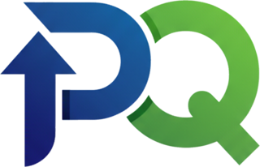
</p>

<h1 align="center">PaulQuiz</h1>

<p align="center">
  <b>Platform edukasi interaktif untuk meningkatkan literasi keuangan & Fintech di Indonesia.</b><br>
  Belajar lewat modul, video, infografis, kuis bergamifikasi, dan simulasi trading kripto tanpa risiko.
</p>

<p align="center">
  
  
  
  
  
  
  
</p>

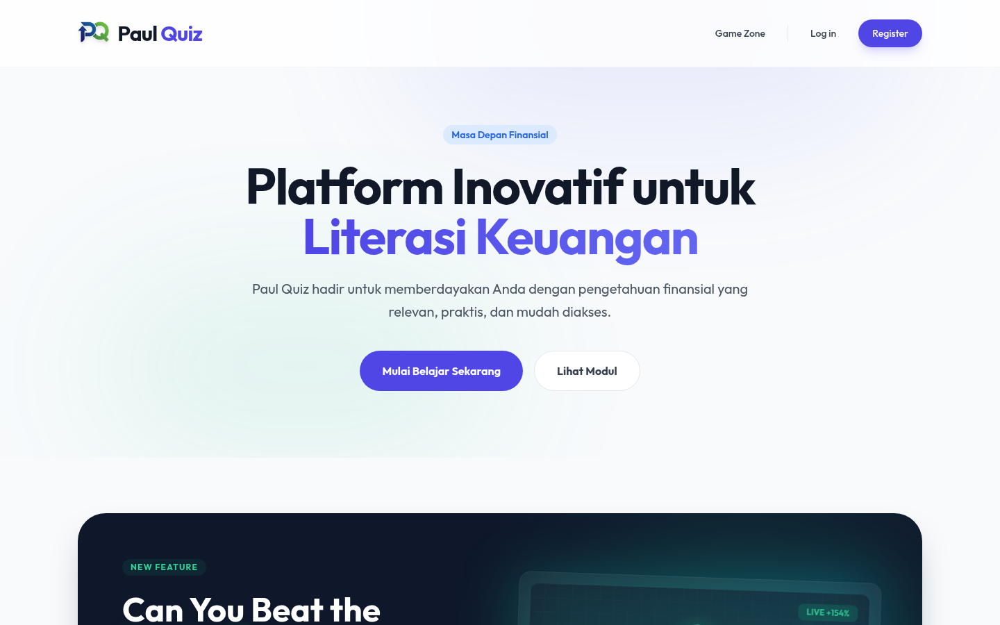

---

## Daftar Isi

- [Tentang Project](#tentang-project)
- [Tampilan Aplikasi](#tampilan-aplikasi)
- [Fitur Utama](#fitur-utama)
- [Tech Stack](#tech-stack)
- [Menjalankan Secara Lokal](#menjalankan-secara-lokal)
- [Akun Demo](#akun-demo)
- [Testing](#testing)
- [Struktur Project](#struktur-project)
- [Dokumentasi Lanjutan](#dokumentasi-lanjutan)
- [Catatan Pengembangan](#catatan-pengembangan)
- [Author](#author)

---

## Tentang Project

**PaulQuiz** adalah aplikasi web edukasi yang membantu masyarakat, khususnya pelajar dan pengguna awam, memahami dunia **Financial Technology (Fintech)**: apa itu Fintech, jenis-jenis layanannya, keamanan digital, hingga regulasi dan perlindungan konsumen.

Materi disusun dalam **modul pembelajaran** yang berisi artikel, video YouTube, infografis, dan kuis. Agar belajar terasa seperti bermain, PaulQuiz memakai **gamifikasi**: pengguna mendapat poin dari membaca materi dan mengerjakan kuis, lalu bersaing di **papan peringkat**. Ada juga **Crypto Trader Panic**, game simulasi pasar kripto untuk melatih insting dan manajemen risiko tanpa uang sungguhan.

Di sisi pengelola, tersedia **Admin Panel** untuk mengelola modul, konten, kuis (pertanyaan dan jawaban), serta mengirim **notifikasi broadcast** ke semua pengguna.

### Masalah yang Diangkat

- Layanan Fintech (dompet digital, pinjol, investasi online) makin banyak dipakai, tetapi pemahaman literasi keuangan dan keamanannya masih rendah.
- Materi edukasi keuangan sering terasa kering dan membosankan.
- Banyak pemula ingin mencoba trading tanpa memahami risikonya.

PaulQuiz menjawabnya dengan materi singkat yang mudah dicerna, kuis untuk mengukur pemahaman, dan simulasi untuk merasakan risiko pasar secara aman.

---

## Tampilan Aplikasi

| Halaman Utama | Daftar Modul |
|---|---|
|  | 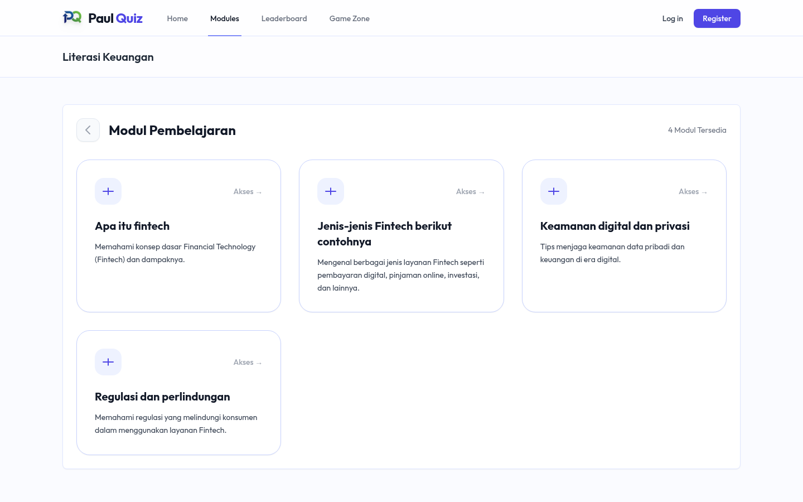 |
| **Detail Modul** | **Kuis** |
| 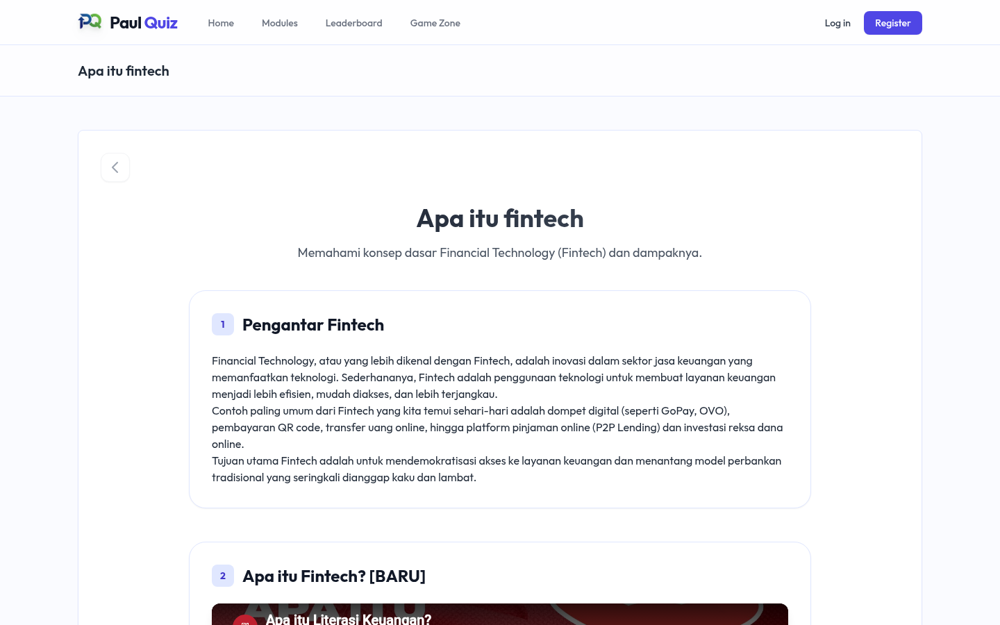 | 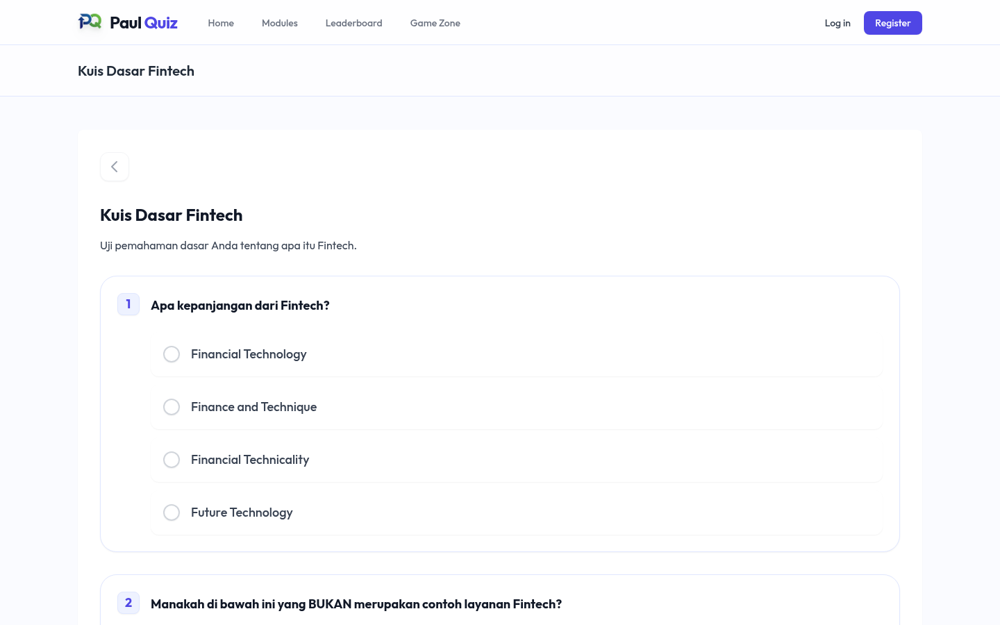 |
| **Hasil Kuis & Riwayat Percobaan** | **Login / Register** |
| 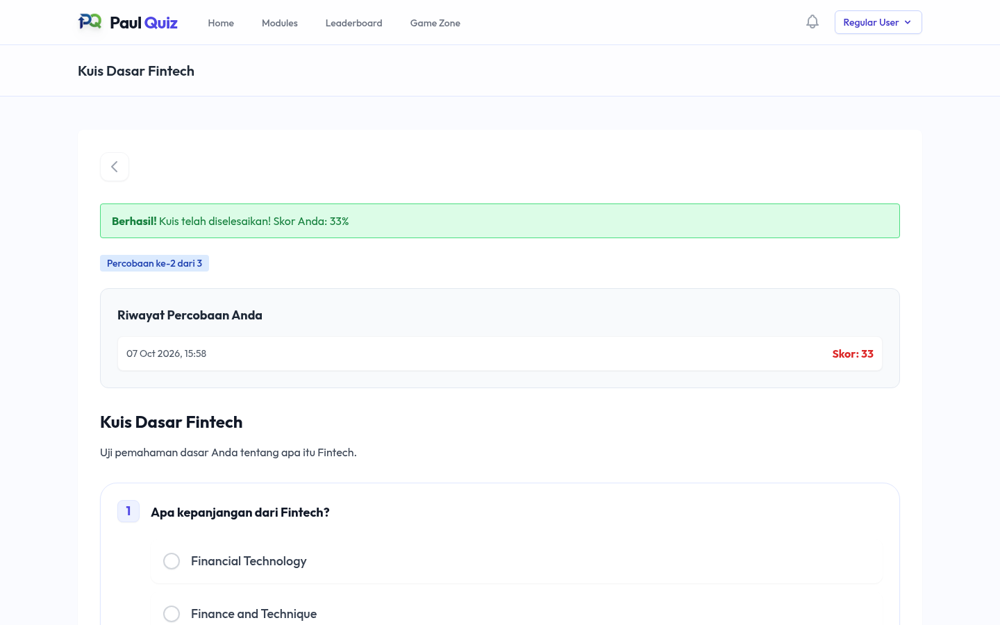 | 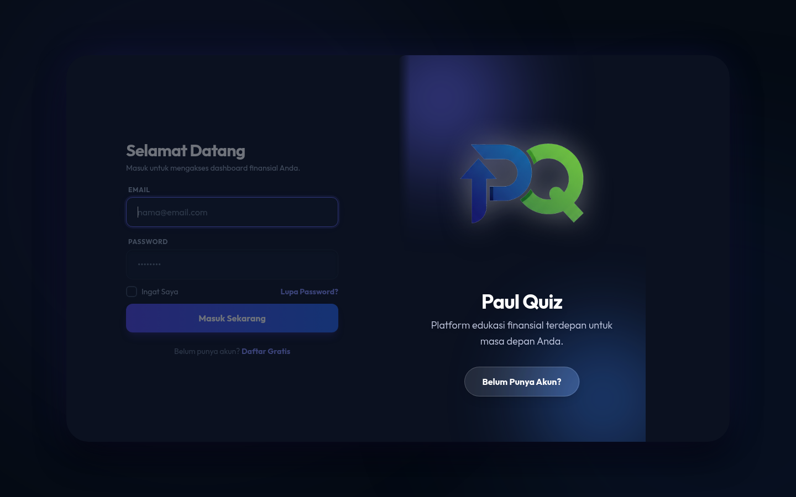 |
| **Crypto Trader Panic: Tutorial** | **Crypto Trader Panic: Gameplay** |
| 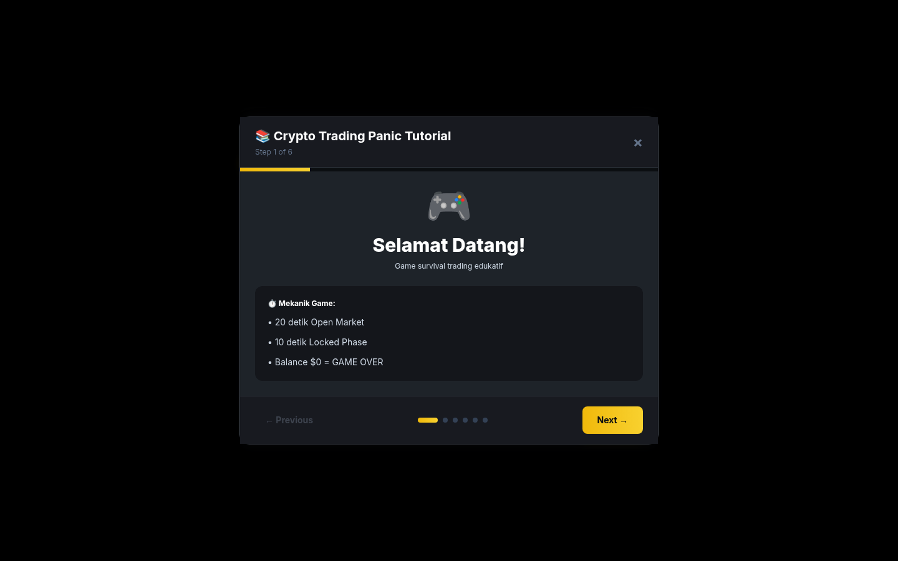 | 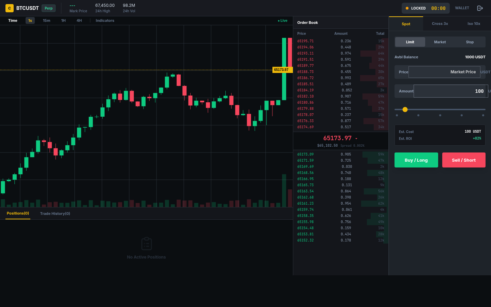 |
| **Leaderboard** | **Statistik Pengguna** |
| 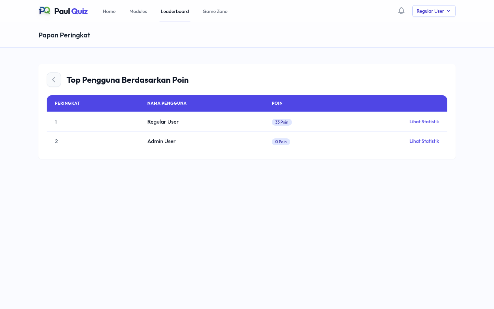 | 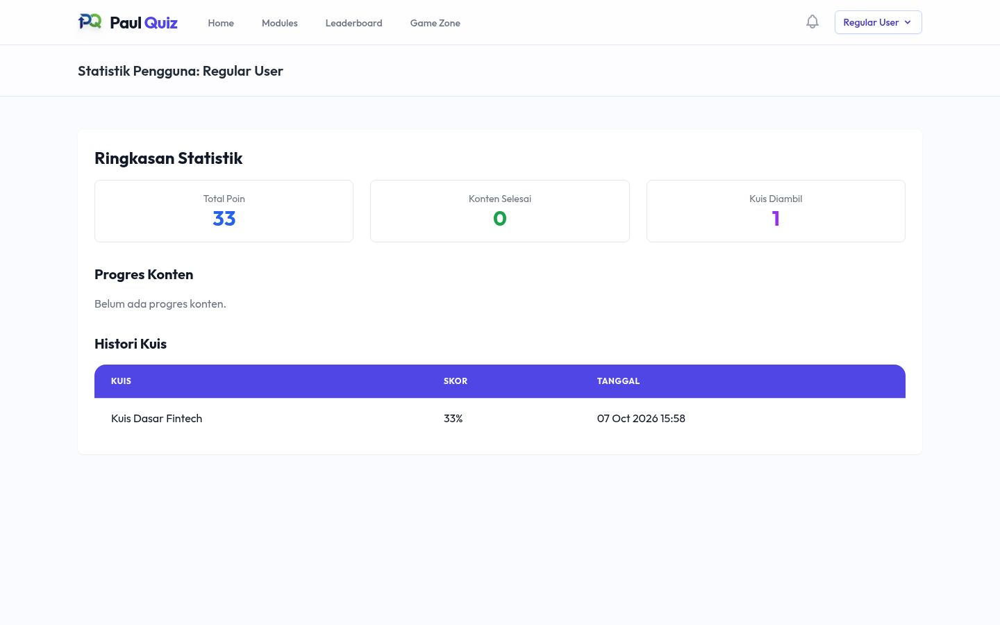 |
| **Admin Dashboard** | **Admin: Manajemen Modul** |
| 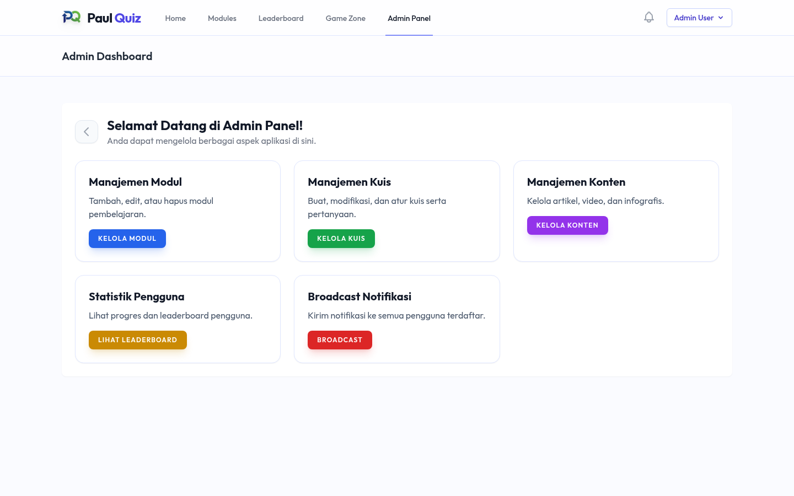 | 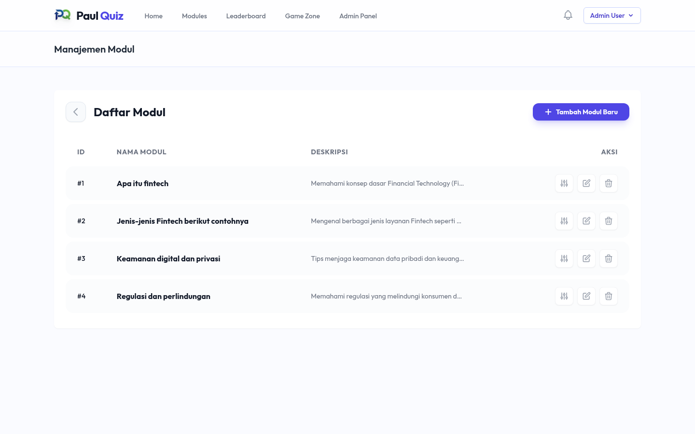 |
| **Admin: Manajemen Kuis** | **Admin: Manajemen Konten** |
| 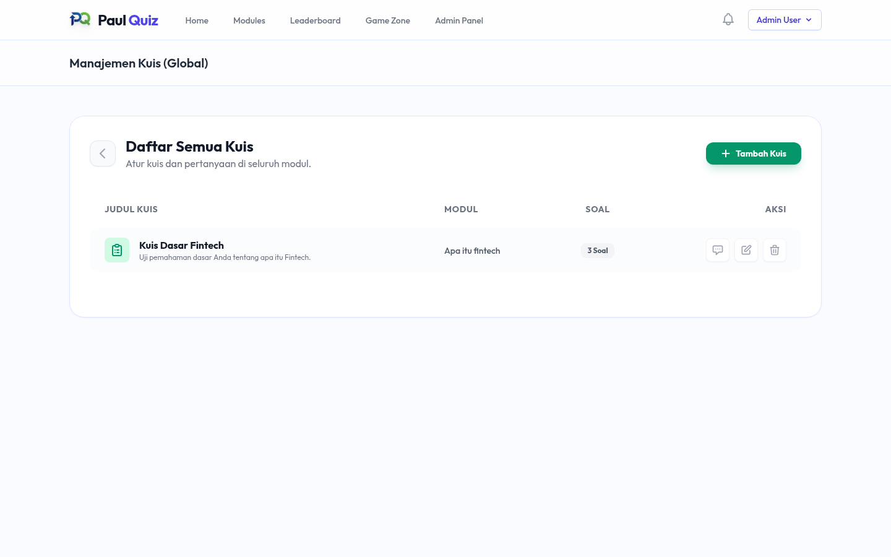 | 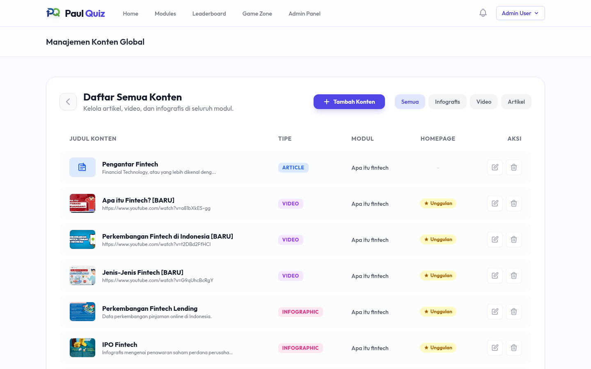 |

<details>
<summary>Tangkapan layar halaman utama secara penuh</summary>

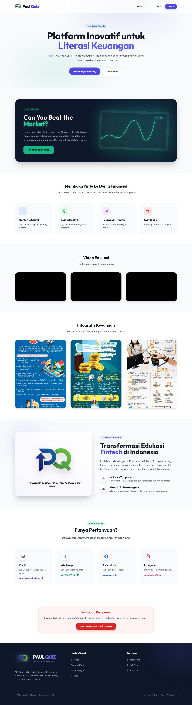

</details>

---

## Fitur Utama

### Untuk Pengunjung & Pengguna

| Fitur | Keterangan |
|---|---|
| **Landing page** | Hero, promo game, video & infografis unggulan, info kontak, dan peringatan penipuan (link ke OJK). |
| **Modul pembelajaran** | 4 modul bawaan: *Apa itu Fintech*, *Jenis-jenis Fintech*, *Keamanan Digital & Privasi*, *Regulasi & Perlindungan*. Konten berupa artikel, video YouTube (otomatis di-embed), infografis, dan kuis. |
| **Akses tamu** | Tamu bisa membuka Modul 1 beserta kuisnya. Modul lain mengharuskan login. |
| **Kuis interaktif** | Pilihan ganda dengan skor 0–100. Maksimal **3 percobaan** per kuis, dan kuis terkunci setelah mendapat **nilai sempurna**. Riwayat percobaan ditampilkan. |
| **Poin & gamifikasi** | +5 poin untuk setiap konten yang pertama kali dibuka, ditambah skor kuis setiap kali kuis dikerjakan. |
| **Leaderboard & statistik** | Peringkat pengguna berdasarkan poin, plus halaman statistik per pengguna (progres konten & riwayat kuis). |
| **Notifikasi real-time** | Lonceng notifikasi yang memeriksa notifikasi baru setiap 15 detik (*polling*), dengan tandai-sudah-dibaca satuan maupun sekaligus. |
| **Status online** | Menampilkan pengguna yang aktif dalam 5 menit terakhir di halaman utama. |
| **Autentikasi lengkap** | Register, login, verifikasi email, lupa/reset password, dan update profil. Template email sudah diberi branding PaulQuiz. |

### Untuk Admin

| Fitur | Keterangan |
|---|---|
| **Manajemen Modul** | CRUD modul pembelajaran. |
| **Manajemen Konten** | CRUD artikel, video, infografis, dan konten kuis, dengan opsi *featured* untuk tampil di halaman utama. |
| **Manajemen Kuis** | CRUD kuis → pertanyaan → jawaban (bertingkat per modul), termasuk penanda jawaban benar dan penjelasan. |
| **Broadcast Notifikasi** | Kirim notifikasi ke seluruh pengguna terdaftar. |
| **Statistik Pengguna** | Akses cepat ke leaderboard dan statistik pengguna. |

### Game: Crypto Trader Panic

Simulasi trading BTC/USDT bergaya exchange profesional (chart candlestick, order book, panel order) yang berjalan sepenuhnya di browser:

- Modal awal **1.000 USDT**.
- Siklus ronde: **20 detik fase TRADING**, saat pemain memilih *Buy/Long* atau *Sell/Short*, lalu **10 detik fase LOCKED**, saat harga bergerak lebih liar dan posisi dikunci.
- Tebakan benar = **+82%** dari taruhan; tebakan salah = taruhan hangus. Saldo habis = **GAME OVER**.
- Tutorial interaktif 6 langkah, riwayat 50 trade terakhir, statistik win/loss & *streak*.
- Progres disimpan di `localStorage`, jadi permainan berlanjut setelah halaman dimuat ulang.

---

## Tech Stack

| Layer | Teknologi |
|---|---|
| Backend | **Laravel 12** (PHP 8.2+), Eloquent ORM, Database Notifications, Database Queue |
| Autentikasi | Laravel Breeze (Blade), email verification, custom notification templates |
| Otorisasi | Middleware `role` custom + [`spatie/laravel-permission`](https://github.com/spatie/laravel-permission) |
| Frontend | Blade, **Tailwind CSS 3** (+ `@tailwindcss/forms`), **Alpine.js 3**, HTML5 Canvas (chart game) |
| Build tool | **Vite 7** + `laravel-vite-plugin` |
| Database | SQLite (default), MySQL didukung |
| Email | SMTP (SendGrid) untuk produksi, driver `log` untuk lokal |
| Testing | **Pest 3** + PHPUnit |

---

## Menjalankan Secara Lokal

### Prasyarat

- PHP **8.2 – 8.4** dengan ekstensi `mbstring`, `xml`/`dom`, `curl`, `zip`, `pdo_sqlite`
- Composer 2
- Node.js 20+ & npm

> Tidak ingin menginstal PHP? Lihat [cara menjalankan dengan Docker](docs/INSTALLATION.md#opsi-b-menggunakan-docker) di dokumentasi instalasi.

### Langkah Instalasi

```bash
git clone https://github.com/SaladinSetyo/PaulQuiz.git
cd PaulQuiz

# 1. Dependensi
composer install
npm install

# 2. Konfigurasi environment
cp .env.example .env
php artisan key:generate
```

Untuk pengembangan lokal, ubah beberapa nilai di `.env` berikut agar email tidak dikirim lewat SendGrid:

```dotenv
APP_NAME=PaulQuiz
APP_DEBUG=true
APP_URL=http://localhost:8000
MAIL_MAILER=log
```

```bash
# 3. Database (SQLite) + data contoh
touch database/database.sqlite
php artisan migrate --seed

# 4. Build aset frontend
npm run build

# 5. Jalankan server
php artisan serve
```

Buka **http://localhost:8000**.

Untuk mode pengembangan dengan *hot reload*, jalankan `composer run dev` (server, queue listener, log viewer, dan Vite dev server sekaligus).

Panduan lengkap, termasuk konfigurasi MySQL, SMTP, dan *troubleshooting*, ada di **[docs/INSTALLATION.md](docs/INSTALLATION.md)**.

---

## Akun Demo

Seeder `RolesAndPermissionsSeeder` membuat dua akun yang sudah terverifikasi dan siap dipakai:

| Peran | Email | Password |
|---|---|---|
| Admin | `admin@example.com` | `password` |
| User | `user@example.com` | `password` |

> Ganti password akun demo sebelum deploy ke produksi.

---

## Testing

```bash
php artisan test
```

Test suite (Pest) mencakup autentikasi (login, register, verifikasi email, reset password dengan notifikasi `CustomResetPassword`), profil, dan hak akses Admin Panel. Status saat ini: **28 test lulus** (64 assertions).

---

## Struktur Project

```
app/
├── Http/Controllers/
│   ├── Admin/            # CRUD modul, konten, kuis, pertanyaan, jawaban, broadcast notifikasi
│   ├── Auth/             # Controller autentikasi (Breeze)
│   ├── ModuleController  # Daftar & detail modul + pencatatan progres/poin
│   ├── QuizController    # Tampil & submit kuis, batas percobaan, skor
│   ├── GameController    # Crypto Trader Panic
│   └── LeaderboardController, NotificationController, ProfileController
├── Http/Middleware/
│   ├── RoleMiddleware    # Guard `role:admin` / `role:user`
│   └── LogLastActivity   # Update `last_seen_at` untuk status online
├── Models/               # User, Module, Content, Quiz, Question, Answer, QuizAttempt, UserProgress
└── Notifications/        # CustomVerifyEmail, CustomResetPassword, GeneralNotification
database/
├── migrations/
└── seeders/              # Roles & akun demo, modul, konten, kuis contoh
resources/views/
├── homepage.blade.php    # Landing page
├── modules/ quizzes/ leaderboard/ users/
├── games/trader.blade.php
├── admin/                # Halaman Admin Panel
└── vendor/mail/          # Template email ber-branding
routes/web.php            # Seluruh rute aplikasi
docs/                     # Dokumentasi & screenshot
```

---

## Dokumentasi Lanjutan

| Dokumen | Isi |
|---|---|
| [docs/INSTALLATION.md](docs/INSTALLATION.md) | Instalasi detail (native & Docker), konfigurasi `.env`, MySQL, SMTP, troubleshooting |
| [docs/ARCHITECTURE.md](docs/ARCHITECTURE.md) | Arsitektur, skema database (ERD), hak akses, daftar rute, aturan poin & kuis, mekanisme game |

---

## Catatan Pengembangan

- **Poin kuis** bertambah di setiap percobaan (maksimal 3 kali), bukan hanya dari skor terbaik.
- **Konten eksternal.** Video (YouTube) dan infografis dimuat dari sumber luar, sehingga membutuhkan koneksi internet.
- **Akun demo** memakai password default dari seeder; ganti sebelum deploy ke produksi.

---

## Author

**Saladin Setyo** · GitHub [@SaladinSetyo](https://github.com/SaladinSetyo)

Dibangun dengan Laravel sebagai project portofolio di bidang edukasi literasi keuangan.
