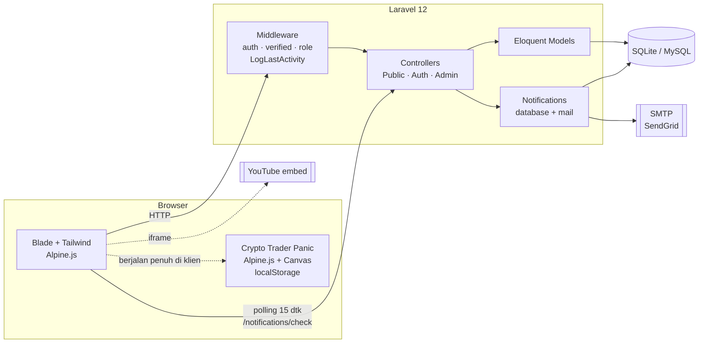
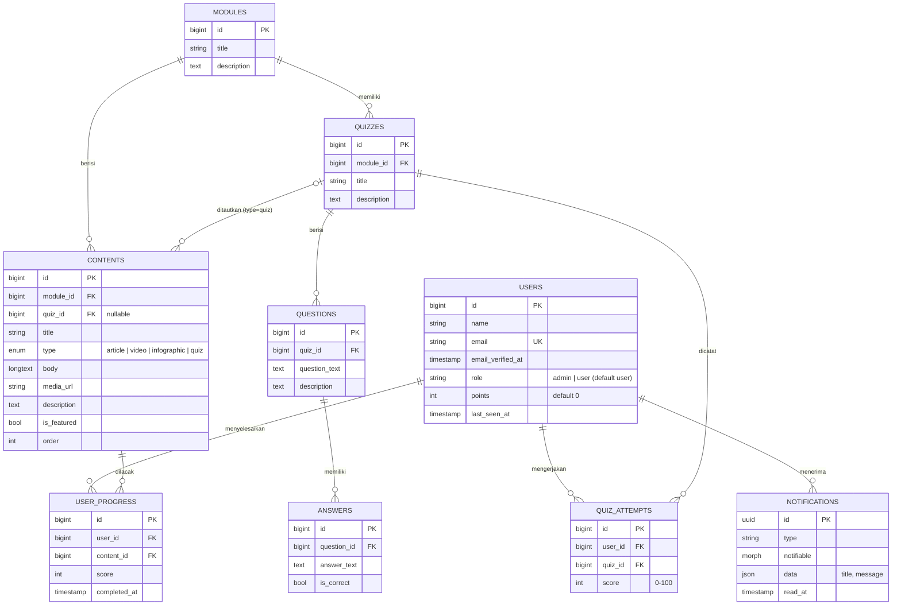
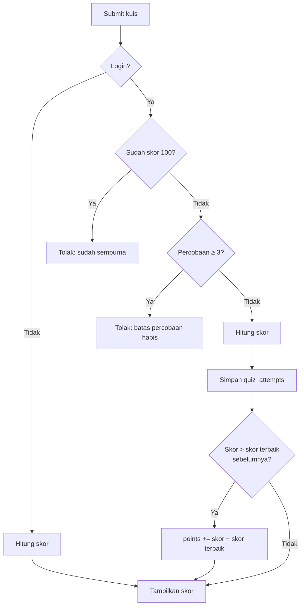
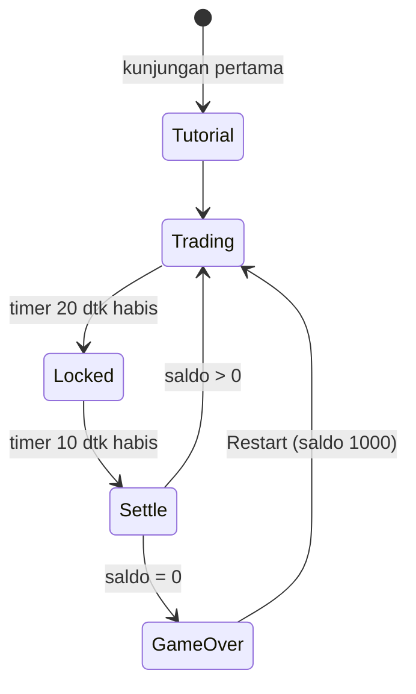

# Arsitektur PaulQuiz

Gambaran teknis PaulQuiz: komponen sistem, skema database, hak akses, rute, serta aturan bisnis kuis, poin, notifikasi, dan game.

← Kembali ke [README](../README.md)

---

## Daftar Isi

- [Gambaran Umum](#gambaran-umum)
- [Skema Database](#skema-database)
- [Hak Akses](#hak-akses)
- [Daftar Rute](#daftar-rute)
- [Aturan Bisnis](#aturan-bisnis)
  - [Kuis](#kuis)
  - [Poin & Leaderboard](#poin--leaderboard)
  - [Konten Modul](#konten-modul)
  - [Notifikasi](#notifikasi)
  - [Status Online](#status-online)
  - [Email](#email)
- [Crypto Trader Panic](#crypto-trader-panic)

---

## Gambaran Umum

PaulQuiz adalah aplikasi **Laravel 12 monolitik** dengan *server-side rendering* (Blade). Interaktivitas di sisi klien ditangani **Alpine.js**, dan styling memakai **Tailwind CSS** yang di-bundle oleh **Vite**.

| Lapisan | Lokasi | Tanggung jawab |
|---|---|---|
| Rute | `routes/web.php`, `routes/auth.php` | Definisi rute publik, pengguna, dan admin |
| Middleware | `app/Http/Middleware` | `RoleMiddleware` (alias `role`) & `LogLastActivity` (ditambahkan ke grup `web`), didaftarkan di `bootstrap/app.php` |
| Controller | `app/Http/Controllers` | Logika halaman publik/pengguna; subfolder `Admin/` untuk CRUD |
| Model | `app/Models` | Relasi Eloquent & accessor (mis. `Content::embed_url`) |
| Notifikasi | `app/Notifications` | Email verifikasi/reset ber-branding dan notifikasi broadcast |
| View | `resources/views` | Blade template per fitur |

---

## Skema Database

Catatan:

- Semua *foreign key* memakai `ON DELETE CASCADE`, kecuali `contents.quiz_id` yang memakai `SET NULL`.
- `user_progress` memiliki *unique key* `(user_id, content_id)`, sehingga satu konten hanya dihitung sekali per pengguna.
- Tabel Spatie (`roles`, `permissions`, `model_has_roles`, dll.), `sessions`, `cache`, dan `jobs` dibuat oleh migrasi tetapi tidak digambarkan di atas.

---

## Hak Akses

| Halaman / Aksi | Tamu | User | Admin |
|---|:-:|:-:|:-:|
| Halaman utama, daftar modul, game | ✅ | ✅ | ✅ |
| Modul 1 & kuisnya | ✅ (skor tidak disimpan) | ✅ | ✅ |
| Modul 2 dst. & kuisnya | ↪ diarahkan ke login | ✅ | ✅ |
| Leaderboard, statistik pengguna, profil, notifikasi | ↪ login | ✅ | ✅ |
| `/user-dashboard` | ↪ login | ✅ | ❌ 403 |
| Admin Panel (`/admin/*`) | ↪ login | ❌ 403 | ✅ |

Pembatasan Modul 1 untuk tamu ada di `ModuleController::show` dan `QuizController::show` (dicek dari `module_id`). Peran admin/user diperiksa oleh `RoleMiddleware` berdasarkan kolom `users.role`. Seeder mengisi kolom ini (`admin`) sekaligus role Spatie untuk akun admin demo; pengguna baru hasil registrasi otomatis bernilai `user`.

---

## Daftar Rute

### Publik

| Method | URI | Nama | Keterangan |
|---|---|---|---|
| GET | `/` | `homepage` | Landing page: konten *featured*, kuis unggulan, pengguna online |
| GET | `/modules` | `modules.index` | Daftar modul |
| GET | `/modules/{module}` | `modules.show` | Detail modul + pencatatan progres |
| GET | `/quizzes/{quiz}` | `quizzes.show` | Halaman kuis & riwayat percobaan |
| POST | `/quizzes/{quiz}/submit` | `quizzes.submit` | Kirim jawaban, hitung skor |
| GET | `/games/trader` | `games.trader` | Crypto Trader Panic |
| GET | `/up` | — | Health check Laravel |

### Pengguna Terautentikasi (`auth`)

| Method | URI | Nama |
|---|---|---|
| GET | `/leaderboard` | `leaderboard.index` |
| GET | `/users/{user}/stats` | `users.stats` |
| GET · PATCH · DELETE | `/profile` | `profile.edit` · `profile.update` · `profile.destroy` |
| GET | `/notifications/check` | `notifications.check` (JSON) |
| POST | `/notifications/{id}/read` | `notifications.read` |
| POST | `/notifications/read-all` | `notifications.readAll` |
| GET | `/dashboard` | `dashboard` (`verified`, diarahkan ke `/`) |
| GET | `/user-dashboard` | `user.dashboard` (`role:user`) |

Rute autentikasi (login, register, verifikasi email, lupa/reset password, konfirmasi password) berasal dari Laravel Breeze di `routes/auth.php`.

### Admin (`auth` + `role:admin`, prefix `/admin`)

| Resource | URI | Controller |
|---|---|---|
| Dashboard | `/admin` | closure → `admin.dashboard` |
| Modul | `/admin/modules` | `Admin\ModuleController` |
| Konten (global) | `/admin/contents` | `Admin\GlobalContentController` |
| Kuis (global) | `/admin/quizzes` | `Admin\GlobalQuizController` |
| Konten per modul | `/admin/modules/{module}/contents` | `Admin\ContentController` |
| Kuis per modul | `/admin/modules/{module}/quizzes` | `Admin\QuizController` |
| Pertanyaan | `/admin/modules/{module}/quizzes/{quiz}/questions` | `Admin\QuestionController` |
| Jawaban | `…/questions/{question}/answers` | `Admin\AnswerController` |
| Broadcast notifikasi | `/admin/notifications/create`, `POST /admin/notifications` | `Admin\NotificationController` |

Semua resource admin adalah `Route::resource` penuh (index, create, store, show, edit, update, destroy). Total aplikasi memiliki **83 rute** (`php artisan route:list --except-vendor`).

---

## Aturan Bisnis

### Kuis

Diimplementasikan di `app/Http/Controllers/QuizController.php`.

1. Jawaban divalidasi: setiap soal wajib dijawab dan ID jawaban harus ada di tabel `answers`.
2. **Skor** = `jumlah soal yang dijawab benar ÷ jumlah soal × 100`, dibulatkan. Hanya jawaban yang memang milik kuis tersebut yang dihitung, dan setiap soal maksimal dihitung sekali.
3. Untuk pengguna login:
   - Setiap pengiriman disimpan sebagai `quiz_attempts`.
   - Maksimal **3 percobaan** per kuis.
   - Setelah mendapat **skor 100**, kuis terkunci dan tidak bisa dikerjakan lagi.
   - Poin hanya bertambah jika skor baru melampaui skor terbaik sebelumnya (lihat [Poin & Leaderboard](#poin--leaderboard)).
4. Untuk tamu: skor ditampilkan, tetapi tidak disimpan dan tidak menambah poin.

### Poin & Leaderboard

| Aksi | Poin |
|---|---|
| Membuka modul (pengguna login) | **+5** untuk setiap konten non-kuis di modul tersebut, hanya pada kunjungan pertama (dijamin oleh `user_progress` yang unik) |
| Mengerjakan kuis | Hanya **skor terbaik** per kuis yang dihitung. Percobaan pertama menambah poin sebesar skornya; percobaan ulang hanya menambah **selisih** jika skornya lebih tinggi. Total poin dari satu kuis = skor terbaiknya (maks. 100). |

Contoh: percobaan 1 skor 33 → +33, percobaan 2 skor 67 → +34, percobaan 3 skor 33 → +0. Total poin kuis = 67.

Leaderboard (`LeaderboardController`) mengurutkan seluruh pengguna berdasarkan `points` secara menurun. Halaman statistik (`users.stats`) menampilkan progres konten dan riwayat kuis seorang pengguna.

### Konten Modul

- Tipe konten: `article` (HTML di `body`), `video`, `infographic` (gambar dari `media_url`), dan `quiz` (tertaut ke `quizzes` lewat `quiz_id`).
- Konten diurutkan berdasarkan kolom `order`.
- Accessor `Content::getEmbedUrlAttribute()` mengubah URL YouTube (`watch?v=`, `youtu.be/`) menjadi URL `embed` untuk iframe.
- Konten dengan `is_featured = true` diprioritaskan tampil di halaman utama (3 video & 3 infografis terbaru).

### Notifikasi

- Admin mengirim broadcast lewat `Admin\NotificationController@store`, yang mengirim `GeneralNotification` (channel `database`) ke **semua** pengguna.
- Navbar memanggil `GET /notifications/check` setiap **15 detik** untuk mengambil jumlah notifikasi belum dibaca beserta notifikasi terbaru.
- Pengguna bisa menandai satu atau semua notifikasi sebagai sudah dibaca.

### Status Online

`LogLastActivity` berjalan di setiap request web. Untuk pengguna login, middleware ini memperbarui `users.last_seen_at`, paling sering sekali per 2 menit agar tidak membebani database. Pengguna dianggap **online** jika `last_seen_at` berada dalam 5 menit terakhir (`User::isOnline()`); halaman utama menampilkan hingga 10 pengguna online.

### Email

`User` mengimplementasikan `MustVerifyEmail` dan meng-override:

- `sendEmailVerificationNotification()` → `CustomVerifyEmail`
- `sendPasswordResetNotification()` → `CustomResetPassword`

Template HTML/teks email ada di `resources/views/vendor/mail` dengan warna dan branding PaulQuiz.

---

## Crypto Trader Panic

Game edukasi di `resources/views/games/trader.blade.php`. Seluruh logika berjalan di sisi klien (Alpine.js + HTML5 Canvas); backend hanya menyajikan view (`GameController@trader`).

| Aspek | Detail |
|---|---|
| Modal awal | 1.000 USDT |
| Fase **TRADING** (20 dtk) | Pemain membuka satu posisi *Buy/Long* atau *Sell/Short*; taruhan dipotong dari saldo |
| Fase **LOCKED** (10 dtk) | Posisi dikunci; volatilitas harga naik dari ±0,1% menjadi ±0,3% per detik |
| Settlement | *Long* menang jika harga naik, *Short* menang jika harga turun. Menang = taruhan kembali **+82%**; kalah = taruhan hangus |
| Game over | Saldo habis → modal *Game Over* dengan ringkasan statistik |
| Visual | Chart candlestick + volume (Canvas), order book simulasi (diperbarui tiap detik), panel order bergaya exchange |
| Persistensi | Saldo, statistik, riwayat 50 trade terakhir, dan status tutorial disimpan di `localStorage` (key `cryptoTradingPanic`) |
| Tutorial | 6 langkah: pengenalan, candlestick, long vs short, manajemen risiko, order book, siap trading |

Tujuan edukasinya adalah menunjukkan betapa cepatnya modal bisa habis pada trading berjangka pendek berisiko tinggi, sejalan dengan pesan literasi keuangan di modul.
